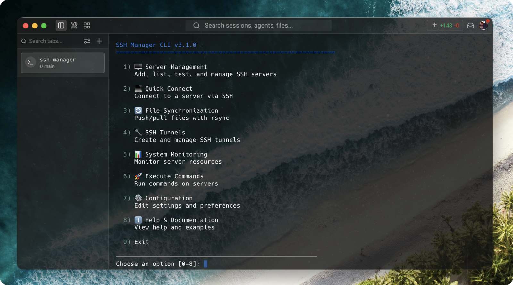

# MCP SSH4Agent - SSH Remote Server Management via Model Context Protocol 🚀

A Model Context Protocol (MCP) server that enables **Claude Code** and **OpenAI Codex** to manage multiple SSH connections. Execute commands, transfer files, manage databases, create backups, monitor health, and automate DevOps tasks across your servers — directly from your AI assistant.

<div align="center">

[](https://www.npmjs.com/package/mcp-ssh4agent)
[](https://www.npmjs.com/package/mcp-ssh4agent)
[](https://github.com/jaredshuai/mcp-ssh4agent/releases)
[](https://claude.ai/code)
[](https://openai.com/codex)
[](https://modelcontextprotocol.io)
[](LICENSE)

[](https://mcptoplist.com/server/glama%2Fjaredshuai%2Fmcp-ssh4agent)

</div>

<p align="center">
  
</p>

---

## 🎉 What's New in v4.0.0

**🏷️ Full rebrand: `ssh-manager` / `mcp-ssh-manager` → `ssh4agent` / `mcp-ssh4agent`**

- **BREAKING** — bin commands are now `ssh4agent` and `mcp-ssh4agent`, and the MCP server registers as `ssh4agent`. Re-add it in your agent — auto-approval patterns become `mcp__ssh4agent__*`.
- **📁 Config directory**: `~/.ssh4agent` — an existing `~/.ssh-manager` keeps loading as a read-only fallback until the new directory exists.
- **🔤 Env vars**: `SSH_MANAGER_*` are now `SSH4AGENT_*`; the log file is `.ssh4agent.log`.
- **⚠️ Remote-side paths changed with no migration**: alert configs live at `/etc/ssh4agent-alerts.json`, backups under `/var/backups/ssh4agent`, scheduled scripts at `/usr/local/bin/ssh4agent-backup-*` — re-run `ssh_alert_setup` and `ssh_backup_schedule` on hosts configured with earlier code.

[Read full changelog →](CHANGELOG.md#400---unreleased)

---

## Previous Releases

<details>
<summary><b>📜 Release history — v3.8.0 down to v1.0.0</b> (click to expand)</summary>

### v3.8.0 - Groups that live in your config, `ssh_sync` fixed on Windows (August 14, 2026)

- **👥 New optional `group` field per server** (contributed by @ice616) — tag a server with `group = "production"` and it *is* in that group: `ssh_execute_group` and `ssh_group_manage list` resolve members straight from your `.env`/TOML. Membership is the **union** of the config tag and any stored `.server-groups.json` list, so groups you already store keep working untouched.
- **🪟 `ssh_sync` works from a Windows host** (contributed by @2836603852) — drive-letter, UNC and extended-length paths are now converted for the rsync argument only, while Node keeps the native path for its filesystem checks.
- **💥 A tunnel on a busy port no longer kills the MCP server** — `ssh_tunnel_create` on an already-bound port now returns a normal error instead of taking the whole process down.
- **🔒 Security: `@modelcontextprotocol/sdk` floor raised to `^1.30.0`** — the previous range still allowed versions carrying three published advisories, one of them high. `npm audit` is clean.
- **🧪 Static type-checking added to CI** (`npm run typecheck`) — it found two of the bugs above on the day it landed.

```env
SSH_SERVER_WEB1_GROUP=production
```

[Full changelog →](CHANGELOG.md#380---2026-08-14)

### v3.7.0 - Per-server SSH agent forwarding (July 13, 2026)

- **🔗 New opt-in `FORWARD_AGENT` / `forward_agent` option** (#53 — requested by [@raphaelbahat](https://github.com/raphaelbahat) in #52) — the equivalent of OpenSSH's `ForwardAgent yes`, per server: processes on the remote host authenticate to *other* SSH hosts with the keys in your local `ssh-agent`, without copying any private key. Requires a running agent and defaults to `false`. [Full changelog →](CHANGELOG.md#370---2026-07-13)

### v3.6.7 - Security: command injection fix in the database helpers (July 11, 2026)

- **🔒 Every `ssh_db_*` argument is now shell-quoted** (#51 — responsibly disclosed by **Ugur Ozer, Aeon AI Risk Management** (http://airiskmanagement.ca), see #48) — caller-controlled values (`ssh_db_list` most notably, which stayed allowed in `readonly`/`restricted` modes) were interpolated into shell-evaluated strings, allowing arbitrary command execution on the SSH target. A centralized `shellQuote()` now wraps every value across all 15 builders, guarded by a 648-combination injection test. [Full changelog →](CHANGELOG.md#367---2026-07-11)

### v3.6.6 - `SUDO_PASSWORD` / `DEFAULT_DIR` / `ssh_sync` key auth work again (July 11, 2026)

- **🔑 camelCase config field reads** (#50 — thanks [@egoan82](https://github.com/egoan82)) — since the v3.0.0 ConfigLoader refactor, `ssh_execute_sudo` ignored `SUDO_PASSWORD`, `DEFAULT_DIR` was ignored by `ssh_execute`/`ssh_group_execute`/`ssh_list_servers`, and `ssh_sync` never passed the configured SSH key to rsync. All aligned with the loader's camelCase fields, with a regression test locking the loader output shape. [Full changelog →](CHANGELOG.md#366---2026-07-11)

### v3.6.5 - `ssh_db_query` shell-injection security fix + real row_count (June 30, 2026)

- **🔒 Queries are delivered on stdin via a single-quoted heredoc** (#44, #45 — thanks [@technophile77](https://github.com/technophile77)) — the remote shell no longer parses backticks/`$(…)` inside queries (which corrupted backtick identifiers **and** let the "SELECT-only" tool run arbitrary shell commands), and `row_count` now reflects each engine's real output instead of counting wrapper lines. [Full changelog →](CHANGELOG.md#365---2026-06-30)

### v3.6.4 - Internal cleanup + a dead-code quality gate (June 18, 2026)

- **🧹 Dead-code removal (−343 lines), zero behavioral change** — removed 27 unused exports and 2 duplicate exports; the MCP server and CLI behave identically (command builders/parsers byte-identical, all 37 tools verified end-to-end). A calibrated `knip.json` plus a **blocking** `knip` CI step keep unused code from creeping back. [Full changelog →](CHANGELOG.md#364---2026-06-18)

### v3.6.3 - `ssh_sync` reports the real transfer count (June 18, 2026)

- **📊 No more false "No files needed to be transferred"** (#42 — thanks [@MakksSh](https://github.com/MakksSh)) — fixed rsync `--stats` parsing: `--stats` is always passed now, and rsync 2.x/3.x wording, openrsync's `B` suffix, and locale separators are all handled. [Full changelog →](CHANGELOG.md#363---2026-06-18)

### v3.6.2 - Richer tool descriptions (June 9, 2026)

- **📝 All 37 tool descriptions rewritten** — every MCP tool now documents its real behavior (side effects, destructive vs read-only nature, idempotency, sudo/auth requirements, security-mode gating, parameter semantics) instead of a 4-to-10-word summary. Agents now know the consequences before invoking a tool; no behavioral change — only `description` strings changed. [Full changelog →](CHANGELOG.md#362---2026-06-09)

### v3.6.1 - Teardown hygiene follow-up (June 9, 2026)

- **🔌 Module-level timers no longer pin the event loop** (follow-up to #41) — `tunnel-manager.js` and `session-manager.js` registered module-level `setInterval`s that were never `unref()`'d, so importing either module kept Node's event loop alive. Both are now `unref()`'d. [Full changelog →](CHANGELOG.md#361---2026-06-09)

### v3.6.0 - Live config hot reload + stdio lifecycle fix (June 9, 2026)

- **♻️ Configuration hot reload** (#40 — thanks [@EnjoySR](https://github.com/EnjoySR)) — add or edit a server in your `.env`/TOML and the running MCP server picks it up on the next call, no restart. A `ServerConfigManager` reloads lazily on file-signature change (path + `mtime` + size); a failed reload keeps the last known-good config; real `process.env` vars keep top priority. No watcher, no polling.
- **🔌 No more orphaned stdio processes** (#41 — thanks [@LegendaryGatz](https://github.com/LegendaryGatz)) — a stdio MCP server is torn down by stdin EOF / SIGTERM, not SIGINT; with only a `SIGINT` handler every session leaked a ~83 MB node process. Shutdown is now idempotent across `SIGINT`/`SIGTERM`/`SIGHUP`/stdin-close, timers are `unref()`'d, and the process exits **~10 ms** after teardown instead of never. [Full changelog →](CHANGELOG.md#360---2026-06-09)

### v3.5.1 - Robust SSH ping health-check on Windows/OpenSSH (May 26, 2026)

- **🪟 Healthy Windows sessions no longer reported as `Dead`** (#39 — thanks [@username77](https://github.com/username77)) — the liveness probe ran `echo "ping"` and `cmd.exe` echoed the quotes literally, failing a strict `=== 'ping'` check and needlessly rebuilding live connections. Now uses `echo ping` parsed by a null-safe `isPingAlive(stdout)` helper (CRLF/quote/case-normalized), covered by `tests/test-ssh-ping.js`. [Full changelog →](CHANGELOG.md#351---2026-05-26)

### v3.5.0 - Per-server security modes — `readonly` / `restricted` + audit log (May 18, 2026)

A second authorization layer that filters tool invocations **inside the MCP server**, complementing the existing client-side `autoApprove`. Useful when sharing the MCP with a third-party agent, a CI bot, or any client where `ssh_execute` shouldn't be unconditionally trusted.

- **🔒 Three modes, opt-in per server** (no `MODE` field = identical to v3.4.x):
  - **`unrestricted`** (default) — strict no-op. `evaluatePolicy()` early-returns on the first line, zero overhead.
  - **`readonly`** — blocks mutating tools (`ssh_upload`, `ssh_deploy`, `ssh_sync`, `ssh_execute_sudo`, `ssh_backup_*`, `ssh_db_import/dump`, plus action-gated `ssh_key_manage accept|remove`, `ssh_alert_setup set`, `ssh_process_manager kill`) AND applies a built-in denylist on `ssh_execute` (rm, mv, dd, mkfs, chmod, chown, sudo, systemctl restart/stop, docker rm/stop, pipe-to-sh, redirect outside `/tmp`, curl|sh, etc.).
  - **`restricted`** — every command must match at least one `ALLOW_PATTERNS` regex AND no `DENY_PATTERNS` regex. **DENY wins**. With no `ALLOW_PATTERNS` everything is refused (fail-closed).
- **📝 Audit log** — opt-in JSONL per server (`SSH_SERVER_<N>_AUDIT_LOG=/path/to/audit.jsonl`). Records `ts`, `server`, `tool`, args, `allowed`, `reason` on denial, `exitCode`/`success` on execution. Sensitive arg fields (`password`, `passphrase`, `sudoPassword`, `token`, `secret`, `apikey`) are replaced with `***`.
- **🪄 Command aliases expanded BEFORE policy evaluation** — a `DENY` pattern can't be bypassed via an alias.
- **♻️ Backward-compatible by design** — a v3.4.x `.env` or TOML loads identically. No `MODE` field → zero behavior change. The interactive wizard (`ssh4agent server add`) defaults all three new prompts to skip. All 13 pre-existing tests pass unmodified. New `tests/test-policy.js` adds 26 tests covering modes, DENY > ALLOW precedence, invalid-regex handling, redaction, and the backward-compat fast path. [Full reference →](docs/SECURITY_MODES.md)

### v3.4.1 - Modern OpenSSH 9.x compatibility (May 16, 2026)

- **🔐 Expanded SSH algorithm list — handshake against OpenSSH 9.x out of the box** (#32)
  - **KEX**: `curve25519-sha256` (+`@libssh.org`), `diffie-hellman-group15-sha512`, `diffie-hellman-group16-sha512`
  - **Server host key**: `rsa-sha2-512`, `rsa-sha2-256` (RFC 8332)
  - **Cipher**: `aes128-gcm@openssh.com`, `aes256-gcm@openssh.com`
  - **HMAC**: `hmac-sha2-256-etm@openssh.com`, `hmac-sha2-512-etm@openssh.com`, `hmac-sha1-etm@openssh.com`
  - Backward-compatible — legacy algorithms preserved at lower preference, older servers (CentOS 7, Debian 10) keep working. Thanks [@YoungHong1992](https://github.com/YoungHong1992).

### v3.4.0 - Windows OpenSSH support + shell-agnostic session sync (May 7, 2026)

- **🪟 Windows OpenSSH encoding & syntax fixes** — UTF-16LE base64 PowerShell payloads (Ansible-style) + `Set-Location` replacing `cd && ` (#31, thanks [@WenKingSu](https://github.com/WenKingSu))
- **🎯 Marker-based SSH session sync** — UUID v4 protocol boundaries with `ECHO: 0` PTY, real `$?` exit codes, no more "Timeout waiting for shell prompt" on custom/slow/AIX shells (#30, thanks [@MakksSh](https://github.com/MakksSh))

### v3.3.0 - ProxyCommand & Critical Fixes (May 2, 2026)

- **🔌 ProxyCommand support** for SOCKS5 / custom proxy commands (#24)
- **⏱️ `ssh_execute` timeout silently capped at 30 s** — fixed (#28, #29)
- **🪟 Windows global install `/bin/bash` shim error** — fixed (#22, #23)
- **🔧 `server add` blocked by missing `rsync`** — `rsync` now optional (#26)
- **🔡 Hyphenated server names silently dropped** — validation hardened (#25, #27)

### v3.2.2 - Global Install Fix & CLI Binary (April 7, 2026)

- **🔧 Global install fixed**: `.env` path resolution now uses a fallback chain instead of hardcoded `__dirname` — works correctly with `npm install -g` (#16, #19)
  - Fallback chain: `~/.ssh4agent/.env` → `cwd/.env` → `~/.env` → project `.env`
  - Auto-creates `~/.ssh4agent/.env` on first `ssh4agent server add`
- **📦 `ssh4agent` CLI registered as binary**: `npm install -g` now creates both `mcp-ssh4agent` and `ssh4agent` commands (#18)
- **⚡ Race condition fix**: Server config is now fully loaded before the MCP server accepts requests

### v3.2.0 - ProxyJump / Bastion Host Support (March 18, 2026)

- **🔀 ProxyJump support**: Connect to servers behind bastion/jump hosts with a simple `PROXYJUMP` config field (#15)
  - Chain multiple jumps (A → B → C) via recursive connections
  - Circular dependency detection prevents infinite loops
  - All tools work transparently through jump hosts
- **📦 npx support fixed**: `npx mcp-ssh4agent` now works correctly (#14)

### v3.1.5 - SSH Agent & Passphrase Support (March 5, 2026)

- **🔑 SSH Agent support**: Automatically uses `ssh-agent` when `SSH_AUTH_SOCK` is available — passphrase-protected keys work transparently
- **🔐 Passphrase configuration**: New `passphrase` field for both `.env` and TOML formats

Thanks to [@snjax](https://github.com/snjax) for the original contribution (#12).

### v3.1.4 - Windows SSH Host Support (February 22, 2026)

- **🪟 Windows SSH host fix**: Commands no longer fail on Windows hosts running OpenSSH (#10)
- New per-server `platform` config field (`SSH_SERVER_FOO_PLATFORM=windows` or `platform = "windows"` in TOML)
- When `platform=windows`, the Linux `timeout`/`sh -c` command wrapper is skipped and the SSH library's native timeout is used instead
- All tools (`ssh_execute`, `ssh_tail`, `ssh_monitor`, `ssh_deploy`, `ssh_execute_sudo`, `ssh_group_execute`) are platform-aware

### v3.1.2 - Windows Compatibility Fix (February 9, 2026)

- **🪟 Windows support**: Fixed crash on Windows where `process.env.HOME` is undefined (#8)
- Now uses `os.homedir()` for cross-platform compatibility (Linux, macOS, Windows)

### v3.1.0 - Tool Activation System (November 15, 2025)

### 🎯 Context Usage Optimization
- **92% context reduction**: Enable only the tools you need (minimal mode: 5 tools vs all 37)
- **Tool management CLI**: `ssh4agent tools list/configure/enable/disable`
- **6 tool groups**: Core, Sessions, Monitoring, Backup, Database, Advanced
- **Auto-approval export**: Generate Claude Code auto-approval configs

### v3.0.0 - Enterprise DevOps Platform (October 1, 2025)

This release adds **12 new MCP tools** transforming SSH4Agent into a comprehensive DevOps automation platform:

### 💾 Backup & Restore System (4 tools)
- **Automated backups** for MySQL, PostgreSQL, MongoDB, and file systems
- **Smart scheduling** with cron integration and retention policies
- **One-click restore** with cross-database support
- **Metadata tracking** for audit and compliance

### 🏥 Health & Monitoring (4 tools)
- **Real-time health checks** with CPU, RAM, Disk, and Network metrics
- **Service monitoring** for nginx, mysql, docker, and custom services
- **Process management** with CPU/RAM sorting and kill capabilities
- **Alert thresholds** with configurable notifications

### 🗄️ Database Management (4 tools)
- **Safe database dumps** with compression and selective exports
- **Database imports** with automatic decompression
- **Schema exploration** listing databases, tables, and collections
- **Secure queries** with SQL injection prevention (SELECT-only)

**📊 Total: 37 MCP Tools** | **🔧 ~4,100 Lines of Code Added** | **✅ Production Ready**

[Read Full Changelog →](CHANGELOG.md#300---2025-10-01)

</details>

---

## 📑 Table of Contents

- [Features](#-features)
- [Tool Management](#-tool-management--context-optimization)
- [Prerequisites](#-prerequisites)
- [Quick Start - Claude Code](#-quick-start---claude-code)
- [Quick Start - OpenAI Codex](#-quick-start---openai-codex)
- [Available MCP Tools](#-available-mcp-tools)
- [Configuration](#-configuration)
- [Usage Examples](#-usage-examples)
- [Security](#-security-best-practices)
- [Troubleshooting](#-troubleshooting)
- [Known Limitations](#known-limitations)
- [Contributing](#-contributing)
- [License](#-license)

---

## 🌟 Features

### Core Features
- **🔗 Multiple SSH Connections** - Manage unlimited SSH servers from a single interface
- **🔐 Secure Authentication** - Support for password, SSH key, and ssh-agent authentication (including passphrase-protected keys)
- **🔀 ProxyJump / Bastion Host** - Connect to servers behind jump hosts with chained multi-hop support
- **🔌 ProxyCommand / Custom Proxy** - Connect through SOCKS5 proxies or custom proxy commands (ncat, ssh -W, etc.)
- **📁 File Operations** - Upload and download files between local and remote systems
- **⚡ Command Execution** - Run commands on remote servers with working directory support
- **📂 Default Directories** - Set default working directories per server for convenience
- **🎯 Easy Configuration** - Simple `.env` file setup with guided configuration tool

### Enterprise DevOps Features (v3.0) 🎉
- **💾 Backup & Restore** - Automated backups for MySQL, PostgreSQL, MongoDB, and files
- **🏥 Health Monitoring** - Real-time server health checks (CPU, RAM, Disk, Services)
- **🗄️ Database Management** - Safe database operations with SQL injection prevention
- **📊 Process Management** - Monitor and control server processes
- **⚠️ Smart Alerts** - Configurable health thresholds and notifications

### v2.0 Features
- **🚀 TypeScript CLI** - Cross-platform CLI for server management (runs natively via Node type stripping, no build step, native on Windows/macOS/Linux)
- **📊 Advanced Logging** - Comprehensive logging system with levels and history
- **🔄 Rsync Integration** - Bidirectional file sync with rsync support
- **💻 Persistent Sessions** - Maintain shell context across multiple commands
- **👥 Server Groups** - Execute commands on multiple servers simultaneously
- **🔧 SSH Tunnels** - Local/remote port forwarding and SOCKS proxy support
- **📈 System Monitoring** - Real-time monitoring of CPU, memory, disk, and network
- **🏷️ Server Aliases** - Use short aliases instead of full server names
- **🚀 Smart Deployment** - Automated file deployment with permission handling
- **🔑 Sudo Support** - Execute commands with sudo privileges securely
- **📝 OpenAI Codex Support** - Compatible with OpenAI Codex via TOML configuration

---

## ⚙️ Tool Management & Context Optimization

**NEW in v3.1**: Reduce Claude Code context usage by 92% with tool activation management!

MCP SSH4Agent includes **37 tools** organized into **6 groups**. By default, all tools are enabled, but you can optimize for your specific workflow:

### Quick Setup

```bash
# Interactive configuration wizard
ssh4agent tools configure

# View current configuration
ssh4agent tools list

# Enable/disable specific groups
ssh4agent tools enable monitoring
ssh4agent tools disable backup
```

### Configuration Modes

| Mode | Tools | Context Usage | Best For |
|------|-------|---------------|----------|
| **All** (default) | 37 tools | ~43.5k tokens | Full feature set, most users |
| **Minimal** | 5 tools | ~3.5k tokens | Basic SSH operations only |
| **Custom** | 5-37 tools | Varies | Tailored to your workflow |

### Tool Groups

- **Core** (5 tools) - Always enabled: list, execute, upload, download, sync
- **Sessions** (4 tools) - Persistent SSH sessions
- **Monitoring** (6 tools) - Health checks, service status, process management
- **Backup** (4 tools) - Database and file backups
- **Database** (4 tools) - MySQL, PostgreSQL, MongoDB operations
- **Advanced** (14 tools) - Deployment, sudo, tunnels, groups, aliases, etc.

### Benefits

- **92% context reduction** in minimal mode (~40k tokens saved)
- **Fewer approval prompts** in Claude Code
- **Faster loading** and cleaner interface
- **Auto-approval configuration** export for Claude Code

📖 [**Complete Tool Management Guide →**](docs/TOOL_MANAGEMENT.md)

---

## 📋 Prerequisites

- Node.js (v23.6 or higher for working on the sources; **v20+ is enough to run the published npm package** — see Quick Start)
- npm (comes with Node.js)
- **Platforms**: Linux, macOS, Windows
- **For Claude Code**: Claude Code CLI installed
- **For OpenAI Codex**: Codex CLI configured
- rsync (optional, for file synchronization)
- sshpass (optional, for rsync with password authentication)
  - macOS: `brew install hudochenkov/sshpass/sshpass`
  - Linux: `apt-get install sshpass`

## 🚀 Quick Start - Claude Code

> **Requires Node.js ≥ 20** for the npm package (`npx -y mcp-ssh4agent` — it ships as compiled JS). Working from the sources instead requires Node ≥ 23.6 (native TypeScript type stripping, no build step).

### 1. Install MCP SSH4Agent

**Option A: Run from npm with npx (recommended — nothing to install)**

```bash
# One-shot run (agents use this form; npx fetches mcp-ssh4agent on demand)
npx -y mcp-ssh4agent

# Or install globally
npm install -g mcp-ssh4agent
```

**Option B: Install from source**

```bash
# Clone and install
git clone https://github.com/jaredshuai/mcp-ssh4agent.git
cd mcp-ssh4agent
npm install

# Install the ssh4agent CLI globally (optional — uses npm link)
npm run install-cli

# Configure your first server
ssh4agent server add
```

### 2. Install to Claude Code

```bash
# For personal use (current user only) — npx form, no local checkout needed
claude mcp add ssh4agent -- npx -y mcp-ssh4agent

# For team sharing (creates .mcp.json in project)
claude mcp add ssh4agent --scope project -- npx -y mcp-ssh4agent

# For all your projects
claude mcp add ssh4agent --scope user -- npx -y mcp-ssh4agent

# From a local checkout instead:
claude mcp add ssh4agent node /path/to/mcp-ssh4agent/src/index.ts
```

**Other MCP clients** (Cursor, Cline, etc.): point the client at

```json
{ "command": "npx", "args": ["-y", "mcp-ssh4agent"] }
```

### 3. Configure Auto-Approval (Optional but Recommended)

To avoid being prompted for approval on every SSH command, add auto-approve configuration:

Edit `~/.config/claude-code/claude_code_config.json`:

```json
{
  "mcpServers": {
    "ssh4agent": {
      "command": "node",
      "args": ["/path/to/mcp-ssh4agent/src/index.ts"],
      "autoApprove": [
        "mcp__ssh4agent__ssh_execute",
        "mcp__ssh4agent__ssh_list_servers",
        "mcp__ssh4agent__ssh_upload",
        "mcp__ssh4agent__ssh_download",
        "mcp__ssh4agent__ssh_sync",
        "mcp__ssh4agent__ssh_alias"
      ]
    }
  }
}
```

**Important**: Restart Claude Code after making this change.

For full auto-approval of all SSH tools, see the complete list in [examples/claude-code-config.example.json](examples/claude-code-config.example.json).

### 3.5. Security Modes (Optional, v3.5.0+)

`autoApprove` is all-or-nothing per tool: once `ssh_execute` is approved, anything goes. If you want a **second layer** that filters what the MCP server actually accepts to run — useful when sharing the MCP with a third-party agent, a CI bot, or a client's server — declare a per-server **security mode**.

```bash
# In your .env — three optional fields. Omit them all to keep v3.4.x behavior exactly.
SSH_SERVER_CLIENT_PROD_HOST=client-prod.example.com
SSH_SERVER_CLIENT_PROD_USER=consultant
SSH_SERVER_CLIENT_PROD_KEYPATH=~/.ssh/consultant_ed25519

SSH_SERVER_CLIENT_PROD_MODE=readonly                          # unrestricted | readonly | restricted
SSH_SERVER_CLIENT_PROD_AUDIT_LOG=~/.ssh4agent/audit.jsonl   # opt-in JSONL audit trail
# For mode=restricted, provide an allowlist of regex (DENY wins over ALLOW):
# SSH_SERVER_CI_ALLOW_PATTERNS="^docker (ps|logs);^kubectl get "
```

- **`unrestricted`** (default, no field needed) — identical to pre-v3.5.0 behavior. Zero overhead.
- **`readonly`** — blocks `ssh_upload`, `ssh_deploy`, `ssh_sync`, `ssh_execute_sudo`, backup/db write tools, and built-in destructive commands (`rm`, `mv`, `sudo`, `systemctl restart`, redirects outside `/tmp`, `curl | sh`, …).
- **`restricted`** — every `ssh_execute` command must match at least one `ALLOW_PATTERNS` regex AND no `DENY_PATTERNS` regex.

Existing configs are unaffected — no field is mandatory, no behavior changes unless you opt in. See **[docs/SECURITY_MODES.md](docs/SECURITY_MODES.md)** for the full reference, recipes, and limitations.

### 4. Start Using!

In Claude Code, you can now:

```
"List all my SSH servers"
"Execute 'ls -la' on production server"  # Uses default directory if set
"Run 'docker ps' on staging"
"Upload config.json to production:/etc/app/config.json"
"Download logs from staging:/var/log/app.log"
```

**With Default Directories:**
If you set `/var/www/html` as default for production, these commands are equivalent:
- `"Run 'ls' on production"` → executes in `/var/www/html`
- `"Run 'ls' on production in /tmp"` → executes in `/tmp` (overrides default)

---

## 🚀 Quick Start - OpenAI Codex

### 1. Install MCP SSH4Agent

Same installation as Claude Code (see above), then configure for Codex:

```bash
# Set up Codex integration
ssh4agent codex setup

# Migrate existing servers to TOML format (if you have .env servers)
ssh4agent codex migrate

# Test the integration
ssh4agent codex test
```

### 2. Manual Configuration (Optional)

If you prefer manual setup, add to `~/.codex/config.toml`:

```toml
[mcp_servers.ssh4agent]
command = "node"
args = ["/absolute/path/to/mcp-ssh4agent/src/index.ts"]
env = { SSH_CONFIG_PATH = "/Users/you/.codex/ssh-config.toml" }
startup_timeout_ms = 20000
```

### 3. Configure Servers in TOML Format

Create or edit `~/.codex/ssh-config.toml`:

```toml
[ssh_servers.production]
host = "prod.example.com"
user = "admin"
password = "secure_password"  # or use key_path
key_path = "~/.ssh/id_rsa"   # for SSH key auth (recommended)
passphrase = "key_passphrase" # optional, for passphrase-protected keys
port = 22
default_dir = "/var/www"
group = "production"          # optional, free-form label for grouping/import-export
description = "Production server"

[ssh_servers.staging]
host = "staging.example.com"
user = "deploy"
key_path = "~/.ssh/staging_key"
port = 2222
default_dir = "/home/deploy/app"

[ssh_servers.winhost]
host = "192.168.1.90"
user = "svc-ssh"
key_path = "~/.ssh/winhost_key"
port = 2222
platform = "windows"
description = "Windows host via OpenSSH"

[ssh_servers.bastion]
host = "bastion.example.com"
user = "jumpuser"
key_path = "~/.ssh/bastion_key"

[ssh_servers.internal]
host = "10.0.0.5"
user = "admin"
key_path = "~/.ssh/internal_key"
proxy_jump = "bastion"
description = "Private server behind bastion"
```

💡 **See [examples/codex-ssh-config.example.toml](examples/codex-ssh-config.example.toml) for more complete examples!**

### 4. Start Using in Codex!

In OpenAI Codex, you can now:

```
"List my SSH servers"
"Execute 'docker ps' on production"
"Upload file.txt to staging:/tmp/"
"Monitor CPU usage on all servers"
"Download production:/var/log/app.log to ./logs/"
```

### Converting Between Formats

Switch easily between Claude Code (.env) and Codex (TOML):

```bash
# Convert .env to TOML (for Codex)
ssh4agent codex convert to-toml

# Convert TOML back to .env (for Claude Code)
ssh4agent codex convert to-env
```

Both formats can coexist! The system supports both simultaneously.

---

## 🛠️ Available MCP Tools

### Core Tools

#### `ssh_list_servers`
Lists all configured SSH servers with their details.

#### `ssh_execute`
Execute commands on remote servers.
- Parameters: `server` (name), `command`, `cwd` (optional working directory)
- **Note**: If no `cwd` is provided, uses the server's default directory if configured

#### `ssh_upload`
Upload files to remote servers.
- Parameters: `server`, `local_path`, `remote_path`

#### `ssh_download`
Download files from remote servers.
- Parameters: `server`, `remote_path`, `local_path`

#### `ssh_sync`
Synchronize files/directories between local and remote using rsync over SSH.
- Parameters: `server`, `source`, `destination` (each with a `local:` or `remote:` prefix), `exclude`, `dryRun`, `delete`, `compress`, `verbose`, `checksum`, `timeout`
- Reports parsed rsync transfer statistics
- Password authentication requires `sshpass`; blocked on `readonly`/`restricted` servers

### Persistent Sessions

#### `ssh_session_start`
Start a persistent SSH session that keeps shell state (working directory, env vars) across commands.
- Parameters: `server`, `name` (optional session name)

#### `ssh_session_send`
Send a command to an existing session.
- Parameters: `session` (session ID), `command`, `timeout` (default 30000 ms)

#### `ssh_session_list`
List all active sessions.
- Parameters: `server` (optional filter)

#### `ssh_session_close`
Close a session.
- Parameters: `session` (session ID, or `"all"` to close every session)

### SSH Tunnels

#### `ssh_tunnel_create`
Create an SSH tunnel.
- Parameters: `server`, `type` (`local` / `remote` / `dynamic` SOCKS), `localPort`, `remoteHost`, `remotePort`

#### `ssh_tunnel_list`
List active tunnels.
- Parameters: `server` (optional filter)

#### `ssh_tunnel_close`
Close tunnels.
- Parameters: `server` (optional — closes all tunnels for that server)

### Server Groups

#### `ssh_execute_group`
Execute a command across all servers in a group.
- Parameters: `group` (e.g. `production`, `all`), `command`, `cwd`, `strategy` (`parallel` / `sequential` / `rolling`), `delay`, `stopOnError`

#### `ssh_group_manage`
Create, update, delete, and inspect named server groups.
- Actions: `create`, `update`, `delete`, `list`, `add-servers`, `remove-servers`
- Parameters: `action`, `name`, `servers`, `description`, `strategy`, `delay`, `stopOnError`
- Groups implied by the per-server `group` config field are listed read-only

### Connection & Host Key Management

#### `ssh_connection_status`
Inspect and manage the pooled SSH connections held by the server process.
- Actions: `status`, `reconnect`, `disconnect`, `cleanup`
- Parameters: `action`, `server` (required for `reconnect`/`disconnect`)

#### `ssh_key_manage`
Manage SSH host key fingerprints in your local `known_hosts`.
- Actions: `verify`, `check`, `list` (read-only), `accept`, `remove` (mutating)
- Parameters: `action`, `server`, `autoAccept` (use with caution)

#### `ssh_history`
View the command execution history.
- Parameters: `limit` (default 20), `server` (optional filter)

### Backup & Restore Tools (v2.1+) 🔄

#### `ssh_backup_create`
Create backup of database or files on remote server.
- Types: MySQL, PostgreSQL, MongoDB, Files
- Parameters: `server`, `type`, `name`, `database`, `paths`, `retention`
- Automatic compression and metadata tracking
- See [Backup Guide](docs/BACKUP_GUIDE.md) for detailed usage

#### `ssh_backup_list`
List all available backups on remote server.
- Parameters: `server`, `type` (optional filter)
- Returns backup details with size, date, and retention info

#### `ssh_backup_restore`
Restore from a previous backup.
- Parameters: `server`, `backupId`, `database`, `targetPath`
- Supports cross-database restoration

#### `ssh_backup_schedule`
Schedule automatic backups using cron.
- Parameters: `server`, `schedule` (cron format), `type`, `name`
- Automatic cleanup based on retention policy

### Health & Monitoring Tools (v2.2+) 🏥

#### `ssh_health_check`
Perform comprehensive health check on remote server.
- Checks: CPU, Memory, Disk, Network, Uptime, Load average
- Returns overall health status (healthy/warning/critical)
- Optional detailed mode for extended metrics

#### `ssh_service_status`
Check status of services (nginx, mysql, docker, etc.).
- Parameters: `server`, `services` (array)
- Returns running/stopped status for each service
- Works with both systemd and sysv init systems

#### `ssh_process_manager`
List, monitor, or kill processes on remote server.
- Actions: list (top processes), kill (terminate), info (details)
- Sort by CPU or memory usage
- Filter processes by name

#### `ssh_alert_setup`
Configure health monitoring alerts and thresholds.
- Actions: set (configure), get (view), check (test thresholds)
- Configurable CPU, memory, and disk thresholds
- Automatic alert triggering when thresholds exceeded

#### `ssh_monitor`
Read-only snapshot of system resources (top, free, df, ss, ps).
- Parameters: `server`, `type` (`overview` / `cpu` / `memory` / `disk` / `network` / `process`, default `overview`), `interval`, `duration`
- Targets Linux tooling; output may be empty on Windows hosts

#### `ssh_tail`
Tail a remote log file, optionally filtered.
- Parameters: `server`, `file`, `lines` (default 10), `follow` (default true), `grep`
- In follow mode output streams to the server process stderr; set `follow: false` to get the last N lines back directly

### Database Management Tools (v2.3+) 🗄️

#### `ssh_db_dump`
Create database dump/backup on remote server.
- Supports: MySQL, PostgreSQL, MongoDB
- Parameters: `server`, `type`, `database`, `outputFile`, `dbUser`, `dbPassword`, `dbHost`, `dbPort`
- Optional: `compress` (gzip), `tables` (specific tables only)
- Returns dump size and location

#### `ssh_db_import`
Import SQL dump or restore database on remote server.
- Supports: MySQL, PostgreSQL, MongoDB
- Parameters: `server`, `type`, `database`, `inputFile`, `dbUser`, `dbPassword`, `dbHost`, `dbPort`
- Handles compressed (.gz) files automatically
- Optional: `drop` (drop database before restore for MongoDB)

#### `ssh_db_list`
List databases or tables on remote server.
- Parameters: `server`, `type`, `database` (optional), `dbUser`, `dbPassword`, `dbHost`, `dbPort`
- Without database: lists all databases (filters system DBs)
- With database: lists all tables/collections
- Returns structured list with count

#### `ssh_db_query`
Execute read-only SQL queries on remote database.
- Parameters: `server`, `type`, `database`, `query`, `dbUser`, `dbPassword`, `dbHost`, `dbPort`
- **Security**: Only SELECT queries allowed for safety
- MongoDB: Use `collection` parameter for find queries
- Returns query results with row count

### Deployment Tools (v1.2+)

#### `ssh_deploy` 🚀
Deploy files with automatic permission and backup handling.
- Parameters: `server`, `files` (array), `options` (owner, permissions, backup, restart)
- Automatically handles permission issues and creates backups

#### `ssh_execute_sudo` 🔐
Execute commands with sudo privileges.
- Parameters: `server`, `command`, `password` (optional), `cwd` (optional)
- Securely handles sudo password without exposing in logs

### Server Management

#### `ssh_alias` 🏷️
Manage server aliases for easier access.
- Parameters: `action` (add/remove/list), `alias`, `server`
- Example: Create alias "prod" for "production" server

#### `ssh_command_alias` 📝
Manage command aliases for frequently used commands.
- Parameters: `action` (add/remove/list/suggest), `alias`, `command`
- Aliases loaded from active profile
- Example: Custom aliases for your project

#### `ssh_hooks` 🎣
Manage automation hooks for SSH operations.
- Parameters: `action` (list/enable/disable/status), `hook`
- Hooks loaded from active profile
- Example: Project-specific validation and automation

#### `ssh_profile` 📚
Manage configuration profiles for different project types.
- Parameters: `action` (list/switch/current), `profile`
- Available profiles: default, frappe, docker, nodejs
- Example: Switch between different project configurations

## 🔧 Configuration

### Profiles

SSH4Agent uses profiles to configure aliases and hooks for different project types:

1. **Set active profile**: 
   - Environment variable: `export SSH4AGENT_PROFILE=frappe`
   - Configuration file: Create `.ssh4agent-profile` with profile name
   - Default: Uses `default` profile if not specified

2. **Available profiles**:
   - `default` - Basic SSH operations
   - `frappe` - Frappe/ERPNext specific
   - `docker` - Docker container management
   - `nodejs` - Node.js applications
   - Create custom profiles in `profiles/` directory

### Environment Variables

Servers are configured in the `.env` file with this pattern:

```env
# Server configuration pattern
SSH_SERVER_[NAME]_HOST=hostname_or_ip
SSH_SERVER_[NAME]_USER=username
SSH_SERVER_[NAME]_PASSWORD=password  # For password auth
SSH_SERVER_[NAME]_KEYPATH=~/.ssh/key  # For SSH key auth
SSH_SERVER_[NAME]_PASSPHRASE=key_passphrase  # Optional, for passphrase-protected keys
SSH_SERVER_[NAME]_PORT=22  # Optional, defaults to 22
SSH_SERVER_[NAME]_DEFAULT_DIR=/path/to/dir  # Optional, default working directory
SSH_SERVER_[NAME]_DESCRIPTION=Description  # Optional
SSH_SERVER_[NAME]_GROUP=production  # Optional, free-form label for grouping/import-export
SSH_SERVER_[NAME]_PLATFORM=windows  # Optional: "linux" (default) or "windows"
SSH_SERVER_[NAME]_PROXYJUMP=bastion  # Optional: name of another server to use as jump host
SSH_SERVER_[NAME]_PROXYCOMMAND=command  # Optional: custom proxy command (ncat, ssh -W, etc.)
SSH_SERVER_[NAME]_FORWARD_AGENT=true  # Optional: forward local ssh-agent to remote (needs SSH_AUTH_SOCK; security risk — see SSH Agent section)

# Example: Linux server
SSH_SERVER_PRODUCTION_HOST=prod.example.com
SSH_SERVER_PRODUCTION_USER=admin
SSH_SERVER_PRODUCTION_PASSWORD=secure_password
SSH_SERVER_PRODUCTION_PORT=22
SSH_SERVER_PRODUCTION_DEFAULT_DIR=/var/www/html
SSH_SERVER_PRODUCTION_DESCRIPTION=Production Server
SSH_SERVER_PRODUCTION_SUDO_PASSWORD=secure_sudo_pass  # Optional, for automated deployments

# Example: Windows server (OpenSSH for Windows)
SSH_SERVER_WINHOST_HOST=192.168.1.90
SSH_SERVER_WINHOST_USER=svc-ssh
SSH_SERVER_WINHOST_KEYPATH=~/.ssh/winhost_key
SSH_SERVER_WINHOST_PORT=2222
SSH_SERVER_WINHOST_PLATFORM=windows
SSH_SERVER_WINHOST_DESCRIPTION=Windows host via OpenSSH

# Example: Server behind a bastion/jump host
SSH_SERVER_BASTION_HOST=bastion.example.com
SSH_SERVER_BASTION_USER=jumpuser
SSH_SERVER_BASTION_KEYPATH=~/.ssh/bastion_key

SSH_SERVER_INTERNAL_HOST=10.0.0.5
SSH_SERVER_INTERNAL_USER=admin
SSH_SERVER_INTERNAL_KEYPATH=~/.ssh/internal_key
SSH_SERVER_INTERNAL_PROXYJUMP=bastion
SSH_SERVER_INTERNAL_DESCRIPTION=Private server behind bastion
```

### Server Management CLI

The `ssh4agent` CLI (TypeScript, run natively via Node type stripping — see [cli/README.md](cli/README.md)) provides:

1. **List servers** - `ssh4agent server list`
2. **Add server** - `ssh4agent server add` (interactive wizard)
3. **Test connection** - `ssh4agent server test <name>`
4. **Remove server** - `ssh4agent server remove <name>`
5. **Show details** - `ssh4agent server show <name>`
6. **Tool management** - `ssh4agent tools list` / `configure` / `enable` / `disable`

## 📁 Project Structure

```
mcp-ssh4agent/
├── src/
│   ├── index.ts              # Main MCP server (37 tools)
│   ├── tool-registry.ts      # Tool groups, policy funnel (wrapWithPolicy)
│   ├── tools/                # MCP tool definitions (6 groups)
│   ├── connection-pool.ts    # Pooled SSH connections (ConnectionPool)
│   ├── ssh-manager.ts        # SSH connection handling
│   ├── config-loader.ts      # .env & TOML config loading
│   ├── server-fields.ts      # Single source of truth for config field names
│   ├── env-path.ts           # Shared .env fallback chain
│   ├── policy.ts             # Per-server security modes (readonly/restricted)
│   ├── session-manager.ts    # Persistent SSH sessions
│   ├── backup-manager.ts     # Backup & restore
│   ├── health-monitor.ts     # Health checks & alerts
│   ├── database-manager.ts   # Database operations
│   ├── tunnel-manager.ts     # SSH tunnel management
│   ├── server-groups.ts      # Group operations
│   └── ...
├── cli/
│   ├── ssh-manager.ts         # CLI main entry (TypeScript, node shebang)
│   ├── commands/              # CLI command modules (.ts)
│   └── lib/                   # CLI libraries (.ts)
├── profiles/                  # Configuration profiles (frappe, docker, nodejs...)
├── examples/                  # Example configs
├── docs/                      # Documentation
└── package.json
```

## 🧪 Testing

### Test Server Connection

```bash
ssh4agent server test production
```

### Verify MCP Installation

```bash
claude mcp list
```

### Check Server Status in Claude Code

```
/mcp
```

## 🔒 Security Best Practices

1. **Never commit `.env` files** - Always use `.env.example` as template
2. **Use SSH keys when possible** - More secure than passwords
3. **Limit server access** - Use minimal required permissions
4. **Rotate credentials** - Update passwords and keys regularly

### 🔑 Passphrase-Protected SSH Keys

MCP SSH4Agent supports passphrase-protected SSH keys in two ways:

**Option 1: SSH Agent (recommended)**

If your SSH key is loaded into `ssh-agent`, MCP SSH4Agent will use it automatically — no configuration changes needed:

```bash
# Add your key to the agent (enter passphrase once)
ssh-add ~/.ssh/your_key

# Verify the key is loaded
ssh-add -l
```

The server detects the `SSH_AUTH_SOCK` environment variable and connects to the running agent. This is the same mechanism that regular `ssh` uses for GUI passphrase prompts.

**Option 2: Passphrase in configuration**

You can store the passphrase directly in the server config:

`.env` format:
```env
SSH_SERVER_MYSERVER_KEYPATH=~/.ssh/id_rsa
SSH_SERVER_MYSERVER_PASSPHRASE="your_passphrase"
```

TOML format:
```toml
[ssh_servers.myserver]
key_path = "~/.ssh/id_rsa"
passphrase = "your_passphrase"
```

> **Note:** SSH Agent is preferred over storing passphrases in config files for better security.

### 🔗 SSH Agent Forwarding

Enable per-server agent forwarding (the equivalent of OpenSSH's `ForwardAgent yes`) so processes on the remote host can authenticate to *other* SSH hosts using the keys in your **local** `ssh-agent` — e.g. `git clone` over SSH on a remote server using your local GitHub key, without copying any private key to the server.

It is **opt-in per server** and defaults to `false`. It requires a running local agent (`SSH_AUTH_SOCK` present); when the agent is unavailable the flag is simply ignored.

`.env` format:
```env
SSH_SERVER_MYSERVER_FORWARD_AGENT=true
```

TOML format:
```toml
[ssh_servers.myserver]
forward_agent = true
```

> ⚠️ **Security warning:** agent forwarding lets any process that can read the forwarded agent socket on the remote host — including anyone with **root** there — use your loaded keys to impersonate you against other hosts *for the life of the connection*. Only enable it for servers you trust, mirroring the same caution `ssh_config(5)` advises for `ForwardAgent`.

## 📚 Advanced Usage

### ProxyJump / Bastion Host

Connect to servers behind a bastion or jump host. The connection is tunneled through the jump server transparently — all tools (execute, upload, download, sync) work as usual.

```env
# Define the bastion server
SSH_SERVER_BASTION_HOST=bastion.example.com
SSH_SERVER_BASTION_USER=jumpuser
SSH_SERVER_BASTION_KEYPATH=~/.ssh/bastion_key

# Point the target server to the bastion
SSH_SERVER_PRIVATE_HOST=10.0.0.5
SSH_SERVER_PRIVATE_USER=admin
SSH_SERVER_PRIVATE_PROXYJUMP=bastion
```

Or in TOML:
```toml
[ssh_servers.bastion]
host = "bastion.example.com"
user = "jumpuser"
key_path = "~/.ssh/bastion_key"

[ssh_servers.private]
host = "10.0.0.5"
user = "admin"
proxy_jump = "bastion"
```

**Chained jumps** are supported: if `bastion` itself has a `proxy_jump`, the chain is followed recursively. Circular references are detected and rejected.

### ProxyCommand / Custom Proxy

Connect through SOCKS5 proxies or custom proxy commands. The proxy command executes locally and forwards traffic to the remote host.

```env
# SOCKS5 proxy via ncat
SSH_SERVER_SOCKS_HOST=target.example.com
SSH_SERVER_SOCKS_USER=admin
SSH_SERVER_SOCKS_PROXYCOMMAND="ncat --proxy 127.0.0.1:1080 --proxy-type socks5 %h %p"

# Windows SSH proxy command
SSH_SERVER_WINPROXY_HOST=internal.example.com
SSH_SERVER_WINPROXY_USER=admin
SSH_SERVER_WINPROXY_PROXYCOMMAND="C:\Windows\System32\OpenSSH\ssh.exe -W %h:%p user@jump-host"
```

Or in TOML:
```toml
[ssh_servers.socks]
host = "target.example.com"
user = "admin"
proxy_command = "ncat --proxy 127.0.0.1:1080 --proxy-type socks5 %h %p"

[ssh_servers.winproxy]
host = "internal.example.com"
user = "admin"
proxy_command = "C:\\Windows\\System32\\OpenSSH\\ssh.exe -W %h:%p user@jump-host"
```

The proxy command must be a valid command that reads from stdin and writes to stdout, accepting `%h` and `%p` placeholders for host and port.

### Server Groups

Tag a server with `group` and it becomes part of that group — no extra file to maintain. The label is free-form and travels with the server definition, so it survives an export to (or import from) another tool.

```env
SSH_SERVER_WEB1_HOST=10.0.0.1
SSH_SERVER_WEB1_USER=deploy
SSH_SERVER_WEB1_GROUP=production

SSH_SERVER_WEB2_HOST=10.0.0.2
SSH_SERVER_WEB2_USER=deploy
SSH_SERVER_WEB2_GROUP=production
```

Or in TOML:
```toml
[ssh_servers.web1]
host = "10.0.0.1"
user = "deploy"
group = "production"
```

Both servers are then reachable as a group:

```
Run "uptime" on the production group     → ssh_execute_group
List my server groups                    → ssh_group_manage (action: list)
```

`ssh_list_servers` also reports the group of each server, so you can see membership without opening the config.

**How it combines with `ssh_group_manage`:** groups you create with `ssh_group_manage` live in `.server-groups.json` and carry execution settings (strategy, delay, stop-on-error). Groups implied by the `group` field carry membership only. When a name exists on both sides, **membership is the union** — the stored list plus every server tagged with that name — and the stored execution settings apply. Group names are case-insensitive.

A group that exists only through the `group` field is read-only for `ssh_group_manage`: to change who belongs to it, edit the servers' `group` in your `.env`/TOML. Creating a group of the same name with `ssh_group_manage` is still allowed and simply adds stored members and settings on top.

### Documentation
- [DEPLOYMENT_GUIDE.md](docs/DEPLOYMENT_GUIDE.md) - Deployment strategies and permission handling
- [ALIASES_AND_HOOKS.md](docs/ALIASES_AND_HOOKS.md) - Command aliases and automation hooks
- Real-world examples and best practices

## 🐛 Troubleshooting

### Claude Code Crashes / Interruptions

**Symptoms:**
- Claude shows "Interrupted: What should Claude do instead?"
- MCP tools execute but Claude stops working
- Commands succeed but Claude freezes

**Solution:** v3.1.1 includes automatic fixes:
- ✅ Output auto-truncated to prevent context overflow
- ✅ Timeout increased to 2 minutes (default), max 5 minutes
- ✅ Standardized error responses

**Performance Tuning** (add to `.env`):
```bash
# Reduce output size (default: 10000 characters)
MCP_SSH_MAX_OUTPUT_LENGTH=5000

# Increase timeout for slow commands (default: 120000ms)
MCP_SSH_DEFAULT_TIMEOUT=180000

# Use compact JSON to save tokens (default: false)
MCP_SSH_COMPACT_JSON=true
```

**For large outputs:**
```bash
# Instead of: cat huge-log.txt
# Use: tail -n 100 huge-log.txt
# Or: grep ERROR huge-log.txt | tail -n 50
```

### MCP Tools Not Available

1. Ensure MCP is installed: `claude mcp list`
2. Restart Claude Code after installation
3. Check server logs for errors

### Connection Failed

1. Test connection: `ssh4agent server test [server_name]`
2. Verify network connectivity
3. Check firewall rules
4. Ensure SSH service is running on remote server

### Permission Denied

1. Verify username and password/key
2. Check SSH key permissions: `chmod 600 ~/.ssh/your_key`
3. Ensure user has necessary permissions on remote server

## 📚 Usage Examples

### Backup & Restore

```
"Backup production MySQL database before deployment"
"List all backups on production server"
"Restore backup from yesterday"
"Schedule daily database backup at 2 AM"
"Backup website files excluding cache and logs"
```

For detailed backup examples, see [examples/backup-workflow.js](examples/backup-workflow.js) and [docs/BACKUP_GUIDE.md](docs/BACKUP_GUIDE.md).

### Using the CLI

```bash
# Basic server management
ssh4agent server list
ssh4agent server add
ssh4agent ssh prod1

# File synchronization
ssh4agent sync push prod1 ./app /var/www/
ssh4agent sync pull prod1 /var/log/app.log ./

# SSH tunnels
ssh4agent tunnel create prod1 local 3307:localhost:3306
ssh4agent tunnel list

# Execute commands
ssh4agent exec prod1 "docker ps"
```

### Using in Claude Code or OpenAI Codex

Once installed, simply ask your AI assistant:

**Claude Code examples:**
- "List my SSH servers"
- "Execute 'df -h' on production server"
- "Upload this file to staging:/var/www/"
- "Create an SSH tunnel to access remote MySQL"
- "Monitor CPU usage on all servers"
- "Start a persistent session on prod1"

**OpenAI Codex examples:**
- "Show my SSH servers"
- "Run df -h on production"
- "Upload file.txt to staging:/tmp/"
- "Check CPU usage on all servers"

Both AI assistants support the same MCP tools! 🚀

---

## 🤝 Contributing

We welcome contributions! Please see [CONTRIBUTING.md](CONTRIBUTING.md) for details.

### Development Setup

1. Fork the repository
2. Clone and install dependencies
3. **Setup pre-commit hooks** for code quality:
   ```bash
   npm run setup-hooks
   ```
4. Create your feature branch
5. Make your changes (hooks will validate on commit)
6. Push to your branch
7. Open a Pull Request

### Code Quality

This project uses automated quality checks:
- **TypeScript typecheck** (tsc in `noEmit` mode; `checkJs` covers the plain-JS tests)
- **Biome** for linting and code formatting
- **Pre-commit hooks** (`npm run setup-hooks`) for automated validation
- **`.env` tracking check** to prevent credential leaks

Run validation manually: `npm run validate`

## 📄 License

This project is licensed under the MIT License - see the [LICENSE](LICENSE) file for details.

## 🙏 Acknowledgments

- Built for [Claude Code](https://claude.ai/code)
- Uses the [Model Context Protocol](https://modelcontextprotocol.io)
- SSH handling via [ssh2](https://www.npmjs.com/package/ssh2)

---

## Known Limitations

### Command Timeout
- The timeout parameter for SSH commands is advisory only
- Due to SSH2 library limitations, commands may continue running on the server even after timeout
- On Linux/macOS hosts, a system `timeout` wrapper is used for reliable command termination
- **Windows hosts**: Set `PLATFORM=windows` in your server config to skip the Linux `timeout`/`sh -c` wrapper (which is incompatible with Windows OpenSSH)

### SSH Sync (rsync)
- Password authentication requires `sshpass` to be installed
- SSH key authentication is recommended for better security and reliability
- **Windows MCP hosts**: pass native local paths such as `local:C:\project` or `local:.\project`; `ssh_sync` converts drive-letter and UNC paths to MSYS2 format before launching rsync. Prefer native paths, since Node checks them on disk using Windows path semantics — a path already written as `/c/...` or `//server/share` is passed through to rsync untouched rather than converted twice.
- Large file transfers may take time and appear to hang - be patient

### Connection Management
- Connections are pooled and reused for performance
- If a connection becomes stale, it will be automatically reconnected on next use
- Force reconnection by using the `ssh_connection_status` tool with `reconnect` action

## 📧 Support

For issues, questions, or suggestions:
- Open an issue on [GitHub Issues](https://github.com/jaredshuai/mcp-ssh4agent/issues)
- Check existing issues before creating new ones

---

<div align="center">

Made with ❤️ for the Claude Code community

<br/><br/>

<a href="https://glama.ai/mcp/servers/@jaredshuai/mcp-ssh4agent">
  
</a>

</div>
